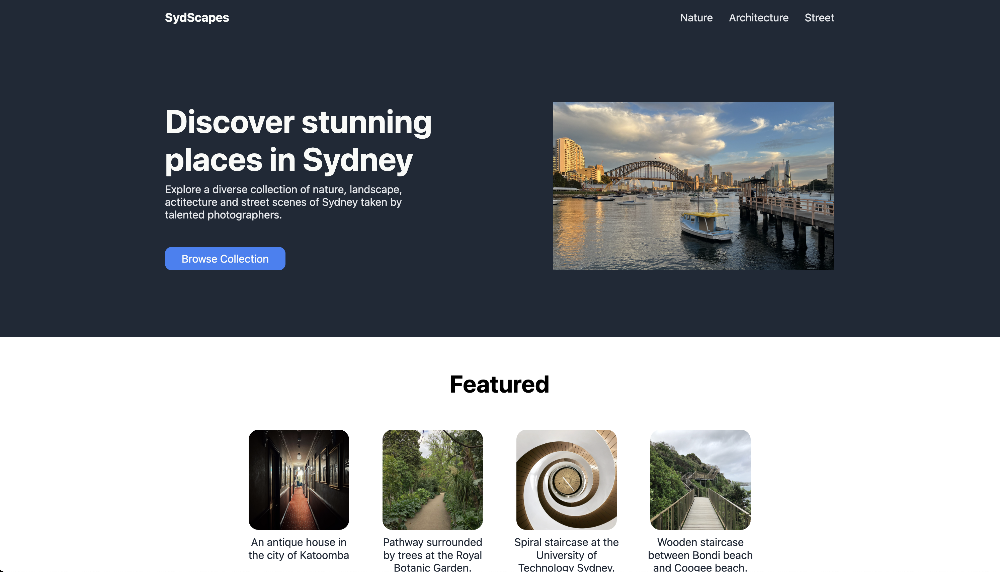
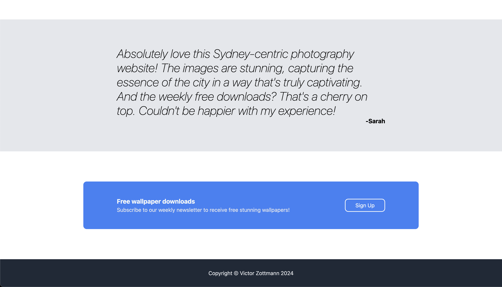

# Landing Page 

This landing page is for a challenge from [The Odin Project](https://www.theodinproject.com/lessons/foundations-landing-page)'s Foundations course.

Given a set of design guidelines, the challenge asks you to try to match the design as much as possible with HTML and CSS.

To personalize it further with a topic I am passionate about, I chose to make the page about photography. All the photos and text added are my own.

[Click here](https://victorzottmann.github.io/css-landing-page/) to see it live!

## Reference layout and My Implementation

For comparison, here is the reference layout followed by my implementation.

### Reference layout

### My implementation

